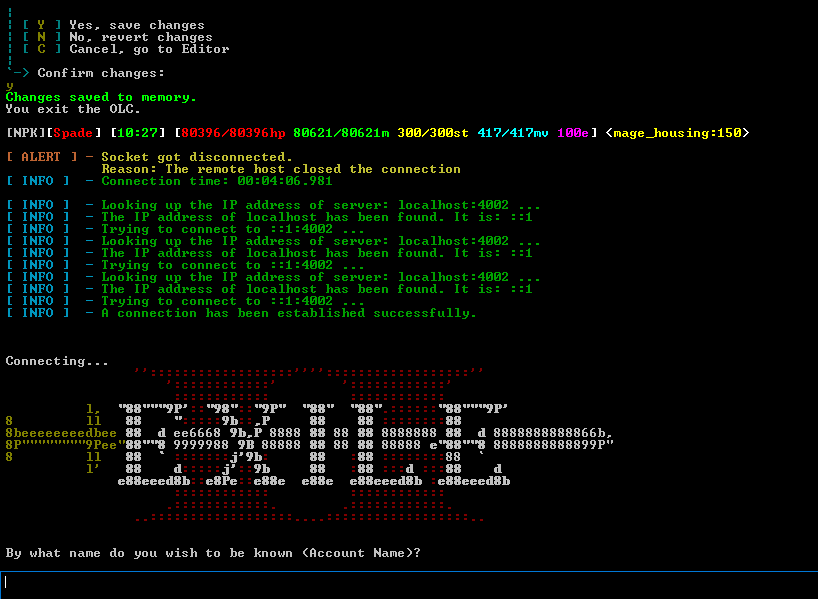
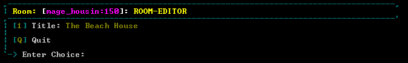
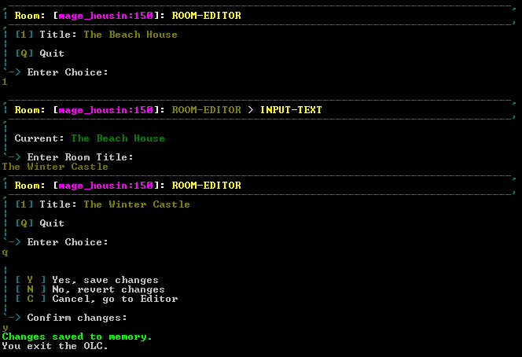
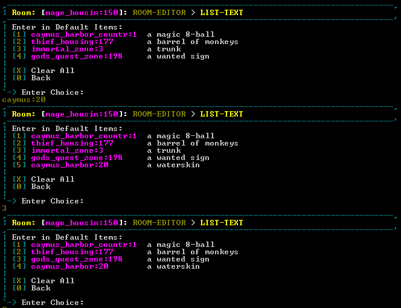
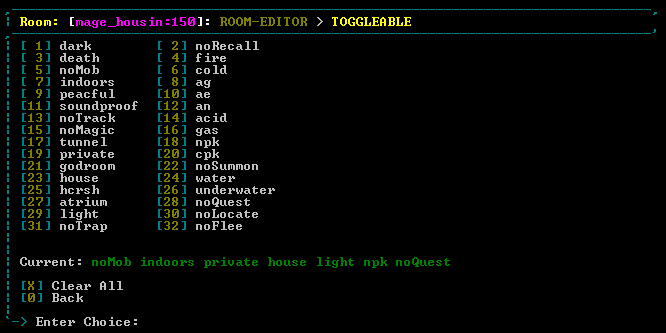
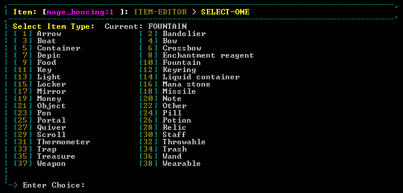

# Axon

Table Of Contents
=================

* [About](#about)
  - [About Ranvier](#about-ranvier)
  - [About Axon](#about-axon)
  - [Axon Demo](#axon-demo)
  - [Install Axon-OLC](#install-axon-olc)
    - [SubModule](#submodule)
    - [Add Code](#add-code)
  - [Known Issues & Notes](#known-issues---notes)
  - [OLC Commands](#olc-commands)
    - [General](#general)
    - [Rooms](#rooms)
    - [Items](#items)
    - [Npcs](#npcs)
    - [Area](#area)
    - [Quests](#quests)
  - [How It Works](#how-it-works)
* [Editors](#editors)
  - [Root-Editor](#root-editor)
  - [Resuable](#resuable)
    - [input-text](#input-text)
    - [editor-text](#editor-text)
    - [list-text](#list-text)
    - [toggleable](#toggleable)
    - [select-one](#select-one)

# About

Axon allows you to customize specific editors (panels or views) to safely and reliably edit your world files within the game inside of a `Ranvier` build MUD. Some customization will be needed to match the properties and the data types of the values of your properties that you want to edit. Axon comes with several reusable editors that make the most common editing really easy to implement.

Some Reusable editors:

- Input-text: Use for simple string sentences, setting values, or entityReferences
- Toggleable: Create a list of selections and toggle as many/few as you would like
- Select-one: Select a single value from a list of created values to assign to a property


## About Ranvier

- To Download Ranvier, see it's [github](https://github.com/RanvierMUD).
- To see Ranvier's 'Getting Started' see [here](https://ranviermud.com/get_started/).
- Questions about Axon or Ranvier, join us on slack: https://ranviermud.slack.com/

## About Axon

Axon is designed to support the majority of the is to support the default entity properties that `Ranvier` supports out of the box. It will be assumed that the developer will need to expand upon this module as it would be impossible to make a flexible module while making it specific enough for YOUR specific needs.

In addition to supplying the developer with some quick tools to change the default `Ranvier` project, the project was designed to easily allow expansion of the editors. Adding additional properties to definitions and reusing template editors allows you to quickly template out new menus and adapt it to your own Mud.

Out of the box, Axon supports:

- Npc
- Item
- Quest
- Room
- Area

## Axon Demo



---

## Install Axon-OLC

### SubModule

From the `Ranvier` root directory:

```bash
npm run install-bundle https://github.com/nelsonsbrian/axon-olc.git
```

Open `ranvier.json` and add `axon-olc` to bundles

Navigate to `axon-olc` directory at `/bundles/axon-olc` and type `npm install`.

Additional Resources: https://ranviermud.com/bundles/

### Add Code

Inside of the `input-events/commands/` add the following code for OLC operation.

```javascript
function loop() {
  // OLC command bypass
  if (player.otherInput) {
    player.otherInput = false;
    return;
  } // end bypass
  player.socket.emit("commands", player);
}
```

You are now all set up to use `Axon-OLC`.

---

## Known Issues & Notes

- Some opinionated decisions were made in the following areas, but the promise of `Axon` is to enable the user to easily add to or change any of the default code:
  1. Colorization and formatting of the menus.
  2. Input validation - Most of the validation uses `@hapi/Joi`
  3. Some commands are included, but aren't necessary for OLC functions (mlist, olist, etc). By default they aren't accessible to newly created players.
  4. A lot of string formating uses `sprintf` library.
- In effort to be modular, especially with the [quests-bundle](https://github.com/RanvierMUD/bundle-example-quests), a `QuestUtil` was made to help in provide the OLC components/options. If you were to want to expand on the quests-bundle, the recommendation would be to add `display` and `configOptions` static methods to all `QuestGoal` and `QuestReward`. The stock quests-bundle comes with `display` static methods in its `QuestReward` class, seen [here](https://github.com/RanvierMUD/bundle-example-quests/blob/da41e1bfc38d3941d0b4a11f1f9d3a82c6e75672/quest-rewards/CurrencyReward.js#L18) while the `QuestGoal` class does not.
- The bundle does not currently leverage the [entityLoader](https://ranviermud.com/extending/entity_loaders/) feature of `Ranvier`.
- Reach out on [Slack](https://ranviermud.slack.com/) with specific issues. @Spade

---

## OLC Commands

### General

- `olc` - Shows a list of areas that have changes made it it, but not saved to disk. Use `redit save`.

### Rooms

- `rlist [areaName]` - lists all the rooms in the specified area. No-arg defaults to current area of player.
- `redit [roomEntityReference]` - Opens the editor for the room. No-arg and . defaults to current room. - `roomEntityReference` has partial lookup. For example, a room with entityReference of `magicForest:1` can be accessed by typing `redit mag:1` as long as there are no other area's with that name higher in the alphabetical order. Note: selecting `yes` to saving when exiting the editor will save the definition in memory, but not to the disk.
- `redit save <areaName | .` - Saves the edited definitions of the specific area to disk. `'.'` argument will select the area the player is currently in.

### Items

- `olist [areaName]` - lists all the items in the specified area. No-arg defaults to current area of player.
- `oedit <itemEntityReference>` - Opens the editor for the specified item. If an an area is found, but not the id, a new item will be created for you to edit. The item will only be added to the `ItemFactory` if you choose to save the definition when exiting the editor. Note: selecting `yes` to saving when exiting the editor will save the definition in memory, but not to the disk.
- `oedit save <areaName | .` - Saves the edited definitions of the specific area to disk. `'.'` argument will select the area the player is currently in.

### Npcs

- `mlist [areaName]` - lists all the npcs in the specified area. No-arg defaults to current area of player.
- `medit <npcEntityReference>` - Opens the editor for the specified npc. If an an area is found, but not the id, a new npc will be created for you to edit. The npc will only be added to the `MobFactory` if you choose to save the definition when exiting the editor. Note: selecting `yes` to saving when exiting the editor will save the definition in memory, but not to the disk.
- `medit save <areaName | .` - Saves the edited definitions of the specific area to disk. `'.'` argument will select the area the player is currently in.

### Area

- `zlist` - lists all the areas in the game.
- `zedit <areaId>` - Opens the editor for the specified area. Currently, you cannot create a new area using this OLC. Stock `Axon` does not come with any properties in `Area` to edit, but the menu is created for you to add in content. Note: selecting `yes` to saving when exiting the editor will save the definition in memory, but not to the disk.
- `zedit save <areaName | .` - Saves the edited definitions of the specific area to disk. `'.'` argument will select the area the player is currently in.

### Quests

- `qlist [areaName]` - lists all the quests in the specified area. No-arg defaults to current area of player.
- `qedit <questEntityReference>` - Opens the editor for the specified quest. If an an area is found, but not the id, a new quest will be created for you to edit. The quest will only be added to the `QuestFactory` if you choose to save the definition when exiting the editor. Note: selecting `yes` to saving when exiting the editor will save the definition in memory, but not to the disk.
- `qedit save <areaName | .` - Saves the edited definitions of the specific area to disk. `'.'` argument will select the area the player is currently in.
  \*Note: The `QuestFactory` is not derived from the `EntityFactory` and thusly uses a different scheme than the other entities. For example, a quest 'definition' is actually `{ id: 300', areaName: 'Limbo', config: {...} }`.

---

## How It Works

The OLC is only available when the user is logged in and has been assigned to the role of `Builder` or higher. When the player has the required role, a set of commands will be available for them to use.

The basic structure is a top-down, tree model. Where you have a root editor (`room-editor`) and you have menues and submenus that nest inside of the root. Some editors are resuable between editing different sorts of entities (`input-text` and `select-one`) while some editors are tailored for the entity or definition being editing (`room-exits`).

Similar to how the login menus work when you first log into the unmodified, base `Ranvier`, `Axon` utilizes [input-events](https://ranviermud.com/coding/input_events/#input-events). During the normal course of the game, the player stays within the [commands loop](https://github.com/RanvierMUD/bundle-example-input-events/blob/7fd7956631dc10f7754a3d0e2a0d6ca3e0348be9/input-events/commands.js#L15) by emitting a `commands` events on the player socket, `player.socket.emit('commands, player)`.

For the OLC, we'll exit that loop and return to a more specific set of event loops. We'll emit which editor file (input-event) we want the user to be in.

An example would be `player.socket.emit('room-editor', player, data)`

1. `room-editor` is the file name of the `input-event` to be called.
2. `player` is the current `Player` object.
3. `data` (inputConfig) is an object literal that holds all the information about the OLC process.

Inside the `inputConfig`, there are some key properties that all the menus use. That is `menuMap` and `eventstack`.
_`menuMap` - is a ES6 Javascript `Map` that is structured with the `input-event` as the key and any pertinent properties stored as values. Those values will be accessed in the following `input-event`. It is structured this way so you can have a separate configuration for each `input-event` fired that will be maintained until you go `back` from that menu.
_`eventStack` - is a simple string array that acts like a traditional stack data type. The FILO (First in last out) model allows the game to remember where the player is inside the nested structure. Since there are reusable editors, once you go back or exit a specific editor, the `eventStack` is popped off to return to the previous menu `player.socket.emit(eventStack.pop(), player, inputConfig)`.

4. `options` options is an object array that holder the menu choices inside of each editor. The list is recalculated and repopulated each command inside the menu.

So putting it all together, we'll look at a common entry for more things you would want to edit:

```javascript
module.exports = () => {
  return {
    event: state => (player, inputConfig) => {
      const socket = player.socket;
      const fileName = path.basename(__filename, '.js');

      // Sets up the default properties to the inputConfig that gets
      // passed to all of the other editors.
      inputConfig = Object.assign({
        menuMap: new Map(), // Stores information about each editor
        eventStack: [], // Keeps track of the position in the editors
        none: `<red>None</red>`,
      }, inputConfig);
      inputConfig.fileName = fileName;

      let { eventStack, menuMap, def, none } = inputConfig;

      let options = [];

      options.push({
        display: 'Title', // Display of the Option
        displayValues: `<yellow>${def.title}</yellow>`, // What the value to be shown
        key: '1', // The selector key, can be anything. If black, the option can't be selected
        onSelect: (choice) => {
          // Add the configuration to the next editor, 'input-text'. Those properties
          // will be extracted inside of the 'input-text' resuable editor.
          menuMap.set('input-text', {
            text: def.title,
            schema: Joi.string().min(1).max(75).required(),
            displayProperty: 'Room Title',
            onExit: choice.onExit,
          });
          eventStack.push(fileName); // add the current place to eventStack
          player.socket.emit('input-text', player, inputConfig); // Emit the next editor to go to.
        },
        onExit: (optionConfig) => {
          // When the 'input-text' is exited, this function will run, saving the result
          // of the input collected inside of the 'input-text' editor.
          def.title = optionConfig.text;
        }
      });

      // Similar to above, this option, when selected with a 'Q', will fire the next
      // editor, 'exit-olc' which hands saving or not saving what was edited.
      options.push({
        display: 'Quit',
        displayValues: '',
        key: 'q',
        bottomMenu: true,
        onSelect: () => {
          eventStack.push(fileName);
          player.socket.emit('exit-olc', player, inputConfig);
        }
      });

      // Show menu compiles all of the options that were pushed into the 'options' array.
      // It will display them and automatticaly wait for the next user input to select.
      // one of the options.
      // The show menu also will stylize the entire menu in a consistent manner and even,
      // show important information a header bar.
      DU.showMenu(player, inputConfig, options);

    }
  };
```

Here is the resulting code displayed in action:



With this next photo, the option `Title` was selected with the `1` being inputed. That fires off the `input-text` editor which automatically asks for a single text input as a response. The next input was `'The Winter Castle'` and that completes the `input-text` and the title was changed to that new input. The editor was then exited with the `'q'` quit command and then the changes were saved typing in a `'y'`.



---

# Editors

## Root-Editor

- `room-editor`
- `item-editor`
- `npc-editor`
- `quest-editor`

## Resuable

### input-text

Allows for the single input text. Can be used for text, number, or anything else you want to validate for. Can search for entityReferences as well.

```javascript
options.push({
  display: "Name",
  displayValues: `<yellow>${def.name}</yellow>`,
  key: "1",
  onSelect: choice => {
    menuMap.set("input-text", {
      text: def.name,
      schema: Joi.string()
        .min(1)
        .max(75)
        .required(),
      displayProperty: "Room Name",
      onExit: choice.onExit
    });
    eventStack.push(fileName);
    player.socket.emit("input-text", player, inputConfig);
  },
  onExit: optionConfig => {
    def.name = optionConfig.text;
  }
});
```


### editor-text

Allows for multiple line input-text field that has additional user options to format and view your text before saving. Use for longer text blocks, mailing letters, help files, or forum posts.

```javascript
options.push({
  display: "Description",
  displayValues: `\r\n` + DU.editorTextDisplayValue(def.description),
  key: "2",
  onSelect: choice => {
    menuMap.set("editor-text", {
      text: def.description,
      params: {
        min: 0,
        max: 2100
      },
      displayProperty: "Description",
      onExit: choice.onExit
    });
    eventStack.push(fileName);
    player.socket.emit("editor-text", player, inputConfig);
  },
  onExit: (optionConfig, cmd) => {
    if (cmd === "@s") {
      def.description = optionConfig.text;
    }
  }
});
```

View:


### list-text

Allows for the submission of multiple text inputs, making a list. Most commonly used in conjunction with lists of entityReferences of `Npc`, `Room`, or `Item`.

```javascript
const items = def.items || [];
options.push({
  display: "Default Items",
  displayValues: items.length || none,
  key: "i",
  onSelect: choice => {
    menuMap.set("list-text", {
      current: [...items], // Current List
      displayProperty: choice.display,
      // getCurrent gets passed each list item then passed to currentDisplay
      getCurrent: er => state.ItemFactory.getDefinition(er),
      currentDisplay: foundDef =>
        foundDef
          ? `${foundDef.level ? `Lvl${foundDef.level}` : ""} ${foundDef.name ||
              ""}`
          : "",
      columns: 1,
      showChoice: false,
      schema: Joi.string().empty(""),
      params: {
        type: "entityReference",
        entityType: "item" // Validate the text entries for valid item entityReferences
      },
      onExit: choice.onExit
    });
    eventStack.push(fileName);
    player.socket.emit("list-text", player, inputConfig);
  },
  onExit: optionConfig => {
    def.items = [...optionConfig.current]; // Update the list when exited.
  }
});
```

View:



### toggleable

Allows for creating an array of primative types, most likely strings. Plug in any selections that you want to be able to be toggled.

```javascript
const flags = def.metadata.flags || [];
options.push({
  display: "Flags",
  displayValues: flags.length ? [...flags].join(" ") : none,
  key: "3",
  onSelect: choice => {
    menuMap.set("toggleable", {
      current: new Set([...flags]),
      selections: new Set([...Object.keys(Roomflag)]),
      displayProperty: choice.display,
      columns: 2,
      minWidth: 10,
      onExit: choice.onExit
    });
    eventStack.push(fileName);
    player.socket.emit("toggleable", player, inputConfig);
  },
  onExit: optionConfig => {
    def.metadata.flags = [...optionConfig.current];
  }
});
```

View:



### select-one

Allows for a single selection of preset values. The `selections` property expects an array of objects with at least a property of `display` defined in each object. The other properties are up to the user to define and the entire object that is selected is passed to the `onExit()` function on the `selection` property.

```javascript
const itemTypeSelections = Object.keys(ItemType).map(type => {
  return {
    // Format your display to whatever you want it to look like.
    display: `${cap(type.toLowerCase().replace("_", " "))}`,
    // Add another property to be used as the 'selection' when returning from
    // the 'select-one' editor.
    type
  };
});
options.push({
  display: `Item Type`,
  displayValues: def.type,
  key: "T",
  onSelect: choice => {
    menuMap.set("select-one", {
      text: def.type || "",
      selections: itemTypeSelections,
      columns: 2,
      minWidth: 8,
      displayProperty: `Item Type`,
      required: true,
      onExit: choice.onExit
    });
    eventStack.push(fileName);
    player.socket.emit("select-one", player, inputConfig);
  },
  onExit: optionConfig => {
    def.type = optionConfig.selection.type;
    // optionConfig.selection.type corresponds to the `type` chosen from the `itemTypeSelections`.
  }
});
```

View:


